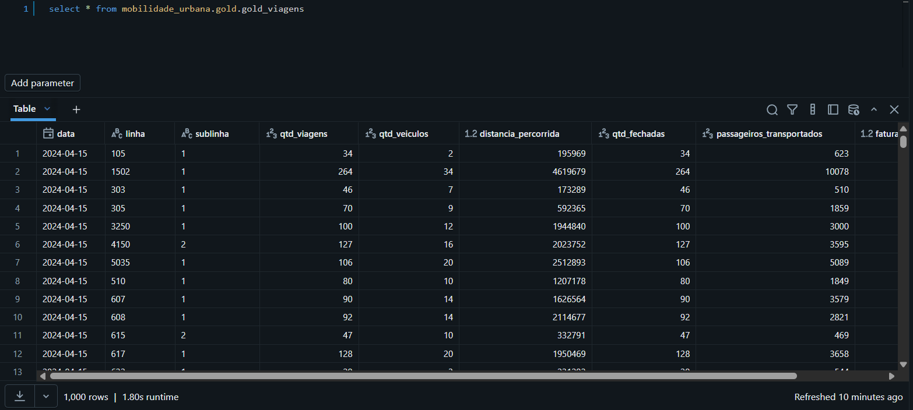

# mobilidade_urbana_pipeline

Projeto de engenharia de dados para aplicar ETL, arquitetura medallion, data lake e data warehouse usando dados públicos sobre a mobilidade urbana de Belo Horizonte (PBH), MG

# Instruções de execução

## Requerimentos:

python 3.8.10
WSL: 2.6.3.0
Homebrew 5.0.14

## Setup de ambiente

Instalar databricks-cli: `brew instal databricks`

Instalar o python venv:
```
sudo apt-get update
sudo apt install python3.8-venv
```

Criar e ativar o ambiente virutal: 
```
python3 -m venv venv
source ./venv/bin/activate
python3 -m pip install --upgrade pip setuptools
pip install -r requirements.txt
```

Configurar databricks CLI:
```
databricks configure --host https://{seu-host}.cloud.databricks.com --token {seu personal access token}
```

## Execução do workflow

Executar databricks bundle:
```
databricks bundle deploy --target dev
databricks bundle run mobilidade_urbana_pipeline
```

## Verificando funcionamento

Após fazer o deploy do workflow (`databricks bundle deploy --target dev`) verifique se subiu corretamente com `databricks bundle summary --target dev`


No menu jobs & pipelines verifique a execução correta da pipeline


Verifique as tabelas no banco fazendo uma consulta SQL `SELECT * FROM mobilidade_urbana.gold.gold_viagens`


# Visão Geral

Este repositório contém um pipeline completo de dados que:

- Extrai dados públicos da API CKAN dos dados de mobilidade urbana
- Constrói camadas Bronze → Silver → Gold (arquitetura medallion)
- Armazena resultados em tabelas Delta hospedadas no Databricks
- Facilita análises e visualizações posteriores

# Estrutura do Repositório

mobilidade_urbana_pipeline/
│
├── src/
│   ├── utils/
│   │   └── extrair_dados_PBH.py           # scripts de API/extracao
│   ├── bronze/
│   │   └── load_bronze_layer.py           # transforma raw → bronze
│   ├── silver/
│   │   └── load_silver_layer.py           # bronze → silver
│   └── gold/
│       └── load_gold_layer.py             # silver → gold
│
├── databricks.yml                         # Job pipeline definido como código
├── tests/                                 # testes automatizados
├── requirements-dev.txt                   # dependências de teste
├── README.md
└── LICENSE

# Detalhamento das etapas

- Extração inicial:
O script utils/extrair_dados_PBH.py é responsável pela extração automatizada dos dados diretamente do portal de dados abertos da Prefeitura de Belo Horizonte (PBH), utilizando a API CKAN para descoberta dos recursos disponíveis.

O processo realiza o download dos arquivos no formato CSV e os armazena em volumes dentro do schema raw_data, compondo a camada Raw do pipeline.

Embora a API CKAN disponibilize endpoints que retornam os dados diretamente na response (formato JSON), essa abordagem possui uma limitação de aproximadamente 192 mil registros por requisição. Considerando o volume de dados do projeto, optou-se pelo download direto dos arquivos CSV completos, garantindo maior confiabilidade, escalabilidade e integridade dos dados — sem abrir mão da automação do processo.

Essa estratégia evita truncamentos, reduz riscos de inconsistência e torna o pipeline mais robusto para cargas históricas e futuras expansões.

- Camada Bronze: 
O script bronze/load_bronze_layer.py acessa os arquivos armazenados no schema raw_data e os grava no schema bronze no formato Parquet. Nesta etapa, os dados são mantidos o mais próximo possível da origem, com poucas transformações aplicadas. O principal objetivo é estruturar os arquivos brutos em um formato otimizado para processamento distribuído, além de adicionar a coluna ingestion_timestamp, que permite rastreabilidade e controle de qualidade das cargas. A escrita é feita no modo append, garantindo que novas execuções do pipeline não sobrescrevam dados históricos.

- Camada Silver
Na camada Silver, os dados provenientes da Bronze são carregados e transformados. Como a origem já apresenta boa qualidade estrutural, não há necessidade de transformações complexas. O foco do script está em ajustes de schema, como conversões de tipos para date, timestamp e integer, remoção de colunas vazias, padronização de nomes, deduplicação de registros e pequenos ajustes de legibilidade. Os dados são salvos no formato Delta utilizando o modo overwrite, garantindo integridade de schema, consistência transacional e versionamento automático.

- Camada Gold
Nesta camada, os dados da Silver são organizados de forma orientada ao negócio. Foram criadas três tabelas fato. 
    - gold_viagen: Consolida métricas relacionadas às viagens, com granularidade por data, linha e sublinha, incluindo indicadores como quantidade de viagens, veículos distintos, distância percorrida, passageiros transportados e faturamento estimado. 
    - gold_ocorrencias: É voltada para análises de interrupções operacionais, trazendo métricas relacionadas às possíveis ocorrências que impedem ou interrompem viagens, com granularidade por data, linha, ocorrência e justificativa, considerando apenas registros onde houve algum evento. 
    - gold_tipo_dia: Possui estrutura semelhante à gold_viagens, porém com granularidade por tipo de dia e linha, permitindo análises comparativas do uso do transporte público entre dias úteis, sábados e domingos/feriados, sem aumentar excessivamente o volume e a granularidade da tabela principal de viagens.
    - dim_ocorrencia: tabela dimensão criada usando script e que possui as descriçòes detalhadas para as justificativas de ocorrencias.
    - dim_tipo_dia: tabela com o descritivo dos tipos de dias referenciados na tabela gold_tipo_dia.
    As tabelas de dimensão podem ser conectada à tabelas gold_ocorrencia em queries e dashboards, melhorando a legibilidades das análises. Estas foram criadas via script pois não foram disponibilizadas como csv pela PBH, estando presentes apenas em um PDF descritivo das tabelas.